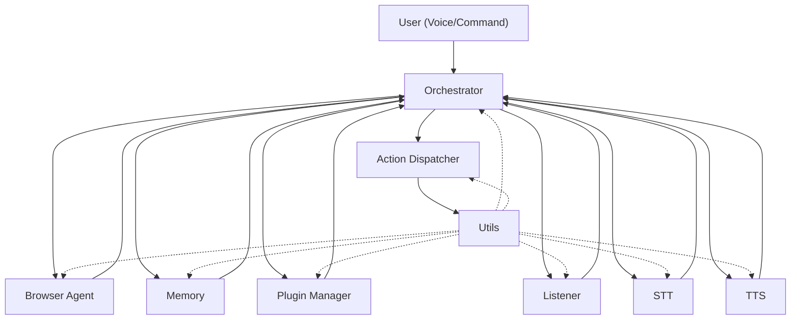

# JARL Local Voice Assistant [WIP]

A modular, extensible local voice assistant framework in Python 3.11+.

## Architecture Overview

JARL est organisé en modules clairs et évolutifs :

- **ai_agents/** : Agents IA autonomes (ex : browser_agent, smol-agents…)
- **core/** : Modules cœur (mémoire, dispatcher, gestion des plugins, utils, audio)
- **services/** : (Réservé pour des services transverses ou futurs)
- **tests/** : Tous les tests unitaires et d’intégration
- **configs/** : Fichiers de configuration YAML
- **prompts/** : Templates de prompts LLM

Cette architecture permet d’ajouter facilement de nouveaux agents, modules cœur ou services.

## Architecture Diagram



## Project Structure

```
JARL-local-voice-assistant/
├── ai_agents/                # Agents IA autonomes
│   └── browser_agent.py
├── core/                     # Modules cœur (mémoire, dispatcher, plugins, utils, audio)
│   ├── action_dispatcher.py
│   ├── listener.py
│   ├── memory.py
│   ├── plugin_manager.py
│   ├── stt.py
│   ├── tts.py
│   └── utils.py
├── services/                 # (Réservé pour futurs services)
├── tests/                    # Tests unitaires et d’intégration
│   ├── test_action_dispatcher.py
│   ├── test_browser_agent.py
│   ├── test_listener.py
│   ├── test_memory.py
│   ├── test_plugin_manager.py
│   ├── test_stt.py
│   ├── test_tts.py
│   └── test_utils.py
├── configs/                  # Fichiers de configuration YAML
│   └── config.yaml
├── prompts/                  # Templates de prompts LLM
│   └── *.tpl / *.json
├── LICENSE
├── README.md
└── requirements.txt
```

## AI Agents
- **browser_agent** : Navigation web autonome (Playwright, BeautifulSoup)

## Core Modules
- **listener** : Capture audio micro, détection hotword
- **stt** : Speech-to-text local (Whisper, Vosk…)
- **tts** : Synthèse vocale locale (Coqui-TTS, eSpeak…)
- **action_dispatcher** : Exécute les plans via des commandes système
- **memory** : Stockage vectoriel (ChromaDB)
- **plugin_manager** : Découverte et chargement de plugins/skills
- **utils** : Logger structuré, chargement config, helpers

## Setup
1. Installe Python 3.11+
2. Installe les dépendances (`requirements.txt` ou `pyproject.toml`)
3. Ajoute ton `configs/config.yaml` et tes prompts si besoin

## Testing
Lance tous les tests avec :
```
pytest
```

---

*Ce projet est prêt pour l’extension avec de nouveaux agents IA, modules cœur et intégrations.*