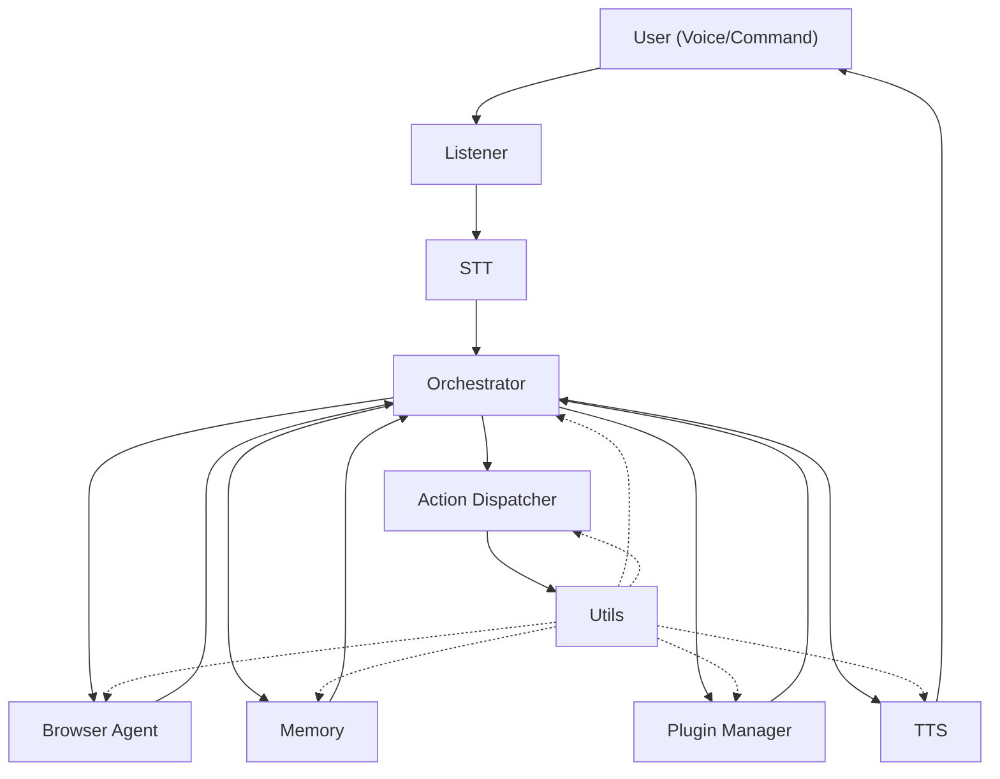

# JARL Local Voice Assistant [WIP]

A modular, extensible local voice assistant framework in Python 3.11+.

## Architecture Overview

JARL is built around a set of specialized modules:

- **AI Agents**: Autonomous modules with reasoning or web interaction capabilities (e.g., browser_agent). These are placed in the `ai_agents/` folder.
- **Services**: Core skills and utilities (listening, STT, TTS, memory, plugins, orchestrator, etc.) in the `services/` folder.
- **Orchestrator**: Central planner, assembling prompts, calling the LLM, and validating plans.
- **Utils**: Shared helpers (config loader, logger, schema loader).
- **Tests**: Each module has dedicated pytest coverage.

This architecture allows for easy extension: new AI agents can be added in the `ai_agents/` folder and discovered dynamically.

## Architecture Diagram



## Project Structure

```
JARL-local-voice-assistant/
├── ai_agents/               # Autonomous AI agents
│   └── browser_agent.py         # Headless browsing & web interaction
├── services/                # Core service modules
│   ├── action_dispatcher.py     # Maps plan steps to subprocess/OS calls
│   ├── listener.py              # Hotkey/wake-word, audio recording
│   ├── memory.py                # Chroma vector DB wrapper
│   ├── orchestrator.py          # FastAPI endpoint, LLM planning
│   ├── plugin_manager.py        # Skill discovery & loading
│   ├── stt.py                   # Speech-to-text (Whisper)
│   ├── tts.py                   # Text-to-speech (Coqui-TTS)
│   └── utils.py                 # Config loader, logger, helpers
├── tests/                   # Pytest test suite for all modules
│   ├── test_action_dispatcher.py
│   ├── test_browser_agent.py
│   ├── test_listener.py
│   ├── test_memory.py
│   ├── test_orchestrator.py
│   ├── test_plugin_manager.py
│   ├── test_stt.py
│   ├── test_tts.py
│   └── test_utils.py
├── configs/                 # YAML config files (expected, not present)
│   └── config.yaml
├── prompts/                 # Prompt templates (expected, not present)
│   └── *.tpl / *.json
├── LICENSE
└── README.md
```

## AI Agents
- **browser_agent**: Headless Playwright browsing, BeautifulSoup scraping, autonomous web interaction

## Services
- **listener**: Detects hotkey/wake-word, records audio
- **stt**: Speech-to-text using Whisper
- **action_dispatcher**: Maps plan steps to subprocess/OS calls
- **tts**: Text-to-speech with Coqui-TTS
- **memory**: Chroma vector DB for embeddings
- **plugin_manager**: Discovers and loads skills
- **orchestrator**: FastAPI endpoint `/plan`, LLM prompt assembly, plan validation
- **utils**: Config loader, structured logger, JSON schema loader

## Setup
1. Install Python 3.11+
2. Install dependencies (see requirements.txt or pyproject.toml)
3. Add your `configs/config.yaml` and any prompt templates as needed

## Testing
Run all tests with:
```
pytest
```

---

*This project is modular and ready for extension with new AI agents, skills, and integrations.*