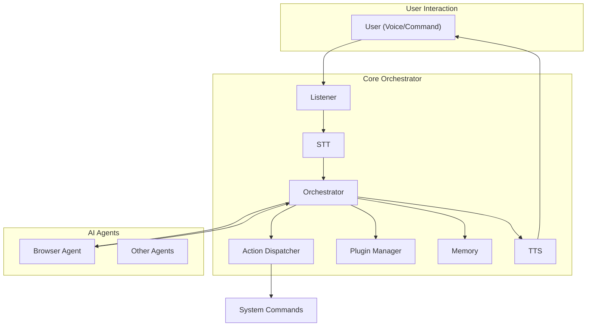

# JARL Local Voice Assistant

**JARL** is a modular, extensible, LLM‑driven local voice assistant framework written in Python 3.11+. Designed to run entirely on your machine, JARL can listen, think, act, and speak without sending data to third‑party servers.

---

## Table of Contents

1. [Overview](#overview)
2. [Technical Stack & Choices](#technical-stack--choices)
3. [Architecture](#architecture)
4. [Project Structure](#project-structure)
5. [Installation](#installation)
6. [Configuration](#configuration)
7. [Usage](#usage)
8. [Testing](#testing)
9. [Contribution Guidelines](#contribution-guidelines)
10. [License](#license)

---

## Overview

JARL (pronounced "jarl") is inspired by Jarvis from the Marvel universe: a conversational agent that reacts to voice commands, executes tasks, and provides spoken feedback.

Key design goals:

- **Local-first**: All speech processing and AI traffic runs locally, preserving privacy and reducing latency.
- **Modular**: Plug new AI agents, audio backends, or plugins with minimal effort.
- **Extensible**: Integrate third‑party tools or Chain‑of‑Thought enhancements.

## Technical Stack & Choices

| Area                           | Component(s)                             | Rationale                                                                         |
| ------------------------------ | ---------------------------------------- | --------------------------------------------------------------------------------- |
| **Language**                   | Python 3.11+                             | Modern typing support, performance improvements, widespread library ecosystem.    |
| **Speech-to-Text (STT)**       | OpenAI Whisper, Vosk                     | Whisper for highest accuracy; Vosk as a lightweight alternative for edge devices. |
| **Text-to-Speech (TTS)**       | Coqui TTS, eSpeak                        | Coqui for natural voices; eSpeak for ultra-lightweight, phoneme‑level control.    |
| **Large Language Model (LLM)** | OpenAI API or local LLM (e.g., GPT‑4All) | Flexibility to switch between cloud and on‑premises models.                       |
| **Memory / Vector DB**         | ChromaDB                                 | Fast, simple vector store with Python API; supports semantic retrieval.           |
| **Browser Automation**         | Playwright, BeautifulSoup                | Playwright for headless browser control; BeautifulSoup for HTML parsing.          |
| **Configuration**              | YAML (`PyYAML`)                          | Human‑readable, supports comments, widely adopted.                                |
| **Plugin System**              | Python `importlib`, entry points         | Dynamic discovery and loading of new skills without modifying core code.          |
| **Testing**                    | `pytest`                                 | Simple, powerful testing framework with fixtures and plugins.                     |

## Architecture



1. **Listener**: Captures audio from microphone, detects hotword.
2. **STT**: Converts audio to text locally.
3. **Orchestrator**: Core logic, invokes memory, plugins, and AI agents.
4. **Action Dispatcher**: Maps high‑level intents to system commands or tool invocations.
5. **Memory**: Vector database for context-aware conversations.
6. **Plugin Manager**: Dynamically loads skills (e.g., smart home control).
7. **TTS**: Synthesizes responses.

## Project Structure

```
JARL-local-voice-assistant/
├── ai_agents/                # Autonomous AI agents (e.g., browser_agent.py)
├── core/                     # Core modules: listener, stt, tts, memory, dispatcher, utils
├── services/                 # Cross‑cutting or future external services
├── configs/                  # YAML configuration files
├── prompts/                  # LLM prompt templates (.tpl, .json)
├── tests/                    # Unit & integration tests (pytest)
├── deploy.sh                 # Deployment helper script
├── requirements.txt          # Pin dependencies
└── README.md                 # <-- this file
```

## Installation

```bash
# Clone the repo
git clone https://github.com/qvelard/JARL-local-voice-assistant.git
cd JARL-local-voice-assistant

# (Optional) Create and activate a virtual environment
python3.11 -m venv venv
source venv/bin/activate

# Install dependencies
pip install -r requirements.txt
```

## Configuration

Copy the example config and edit:

```bash
cp configs/config.example.yaml configs/config.yaml
```

Key settings in `config.yaml`:

- `stt_engine`: `whisper` or `vosk`
- `tts_engine`: `coqui` or `espeak`
- `llm`, `api_key`: Credentials for OpenAI or path to local LLM
- `memory`: ChromaDB settings (embedding model, storage path)
- `hotword`: Custom activation keyword

## Usage

Run the main assistant:

```bash
python -m core.main --config configs/config.yaml
```

- Speak the hotword (default: “Hey JARL”)
- Give your command (“Open the browser and search Python tutorials.”)
- JARL will reply vocally and carry out the action.

## Testing

Execute the full test suite:

```bash
pytest --maxfail=1 --disable-warnings -q
```

## Contribution Guidelines

1. Fork the repository
2. Create a feature branch (`git checkout -b feature/my-skill`)
3. Write tests for your feature
4. Follow the existing module patterns
5. Submit a pull request

Please ensure your code adheres to the [PEP8](https://peps.python.org/pep8/) style guide and includes type annotations.

## License

This project is licensed under the MIT License. See [LICENSE](LICENSE) for details.

